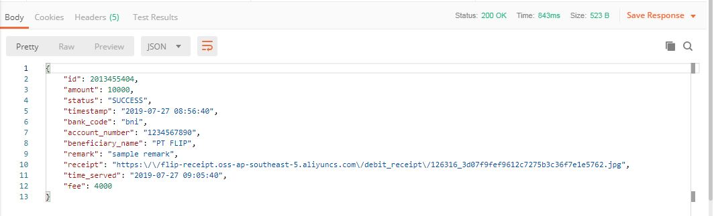

# Disbursement API Service

A working API service that GET/POST disbursement data from/to the 3rd party API and then will save/update the detailed of the information to local database.

## Getting Started

These instructions will get you a copy of the project up and running on your local machine for development and testing purposes.

## Prerequisites

Before installing the service, there are certain applications you will need to install first.

### Required Applications
Application | Name
------|------
Programming Language | [PHP 7 or newer](https://www.php.net/downloads.php)
Database | [MySQL 5 or newer](https://www.mysql.com/downloads/)
Database GUI | [HeidiSQL 10 or newer](https://www.heidisql.com/download.php)
Dev. Tool | [Postman 7 or newer](https://www.getpostman.com/downloads/)

### Optional Applications
Application | Name
------|------
Git | [Windows](https://gitforwindows.org/) / [Linux](https://git-scm.com/download/linux)

## Installing

* For Git user, run from the terimnal to clone this repository

```
$ git clone https://github.com/exneval/mini-project.git
$ cd mini-project
```

* For non Git user, download the project as [ZIP](https://github.com/exneval/mini-project/archive/master.zip) and extract it to your computer.

* Run the `migration.php` to create the database

```
$ php migration.php
```

* Run PHP built-in webserver

```
$ php -S localhost:8000
```

## Running the tests

* Open the Postman and give the GET method to the `http://localhost:8000`, if the Postman recieve HTTP Response Status Code 200, then webserver is successfully running in your machine


* Now send data to the 3rd Party API using POST method to the `http://localhost:8000`. Don't forget to give body attributes as below


* The Postman will recieve the data back and save it to database


* Now get the updated data from the 3rd Party API using GET method to the `http://localhost:8000` and give a param `id` of the transaction


* The Postman will recieve the updated data and also update it to database




* The `status`, `receipt`, and `time_served` attributes of the transaction have been updated

## Authors

**Tri Aginta Ginting** - *Initial work* - [exneval](https://github.com/exneval)
